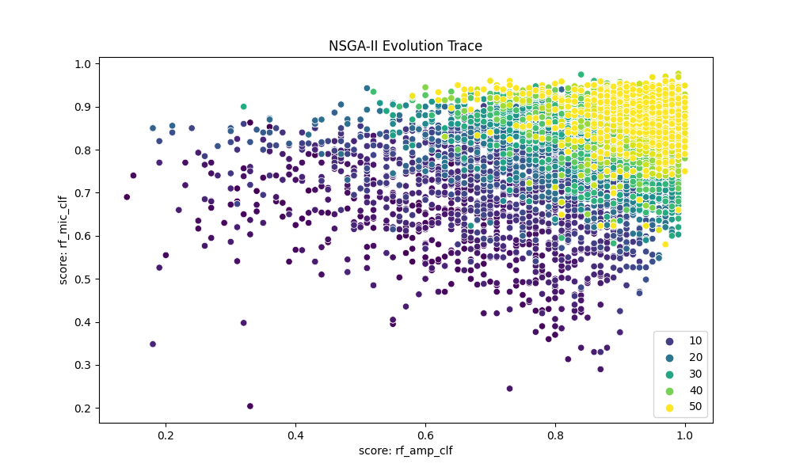

# DDMOPD: A Data-Driven Constrained NSGA-II Antimicrobial Peptide Optimizer
## goals of the project
- to develop a NSGA-II AMP optimizer, optimizing the multi-objective likelihood of being AMP-like, non-toxic (non-hemolytic) and active
## purpose of the project
- to explore data for peptide molecules 
- to assess effectiveness of constrained multi-objective GA
## example results:
- An example Pareto front evolution trace for a full round of GA optimization
